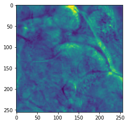
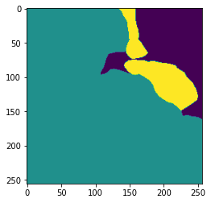
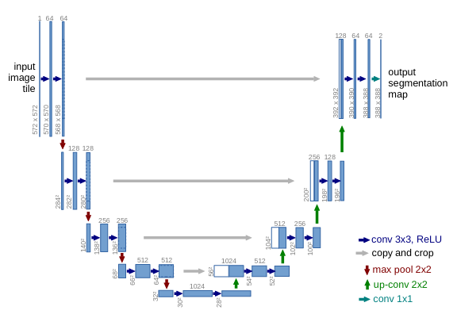

# nahiri-p3

## Introduction

Goal: Designing an algorithm that learns how to segment cilia. 

Background: Cilia are microscopic hairlike structures that protrude from literally every cell in your body. They beat
in regular, rhythmic patterns to perform myriad tasks, from moving nutrients in to moving irritants out to amplifying
cell-cell signaling pathways to generating calcium fluid flow in early cell differentiation. Cilia, and their beating
patterns, are increasingly being implicated in a wide variety of syndromes that affected multiple organs.

Example Image:

 

Example Mask

## Therory

<a href= "https://arxiv.org/pdf/1505.04597.pdf">U-Net: Convolutional Networks for Biomedical Image Segmentation</a>

"The  architecture  consists  of  a  contracting  path  to  capturecontext and a symmetric expanding path that enables precise localiza-tion. We show that such a network can be trained end-to-end from veryfew  images  and  outperforms  the  prior  best  method  (a  sliding-windowconvolutional network) on the ISBI challenge for segmentation of neu-ronal  structures  in  electron  microscopic  stacks..."

## Models
Our team developed two models to solve this classification problem

* Unet: located in the <a href= "https://github.com/dsp-uga/nahiri-p3/blob/main/Unet_v2.ipynb">Unet_v2.ipynb</a> file

### ResNet Model

## Contributions
Please see our [CONTRIBUTORS]() file for more details.

## Authors 
<ul> <li><a href= "https://github.com/clint_kristopher_morris"> Clint Morris</a></li></ul>

## License
This project is licensed under the MIT License - see the <a href="">LICENSE</a> file for the details.
